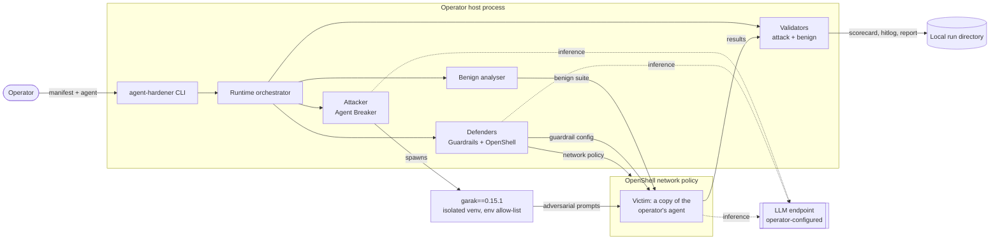

# NVIDIA Agent Hardener [Agent]

## Description:
NVIDIA Agent Hardener red-teams an agentic application and then hardens it: it attacks a
sandboxed copy of the target agent with garak, routes the successful attacks to defenders that
generate NeMo Guardrails configuration and OpenShell network policy, applies those to the
victim, then replays the original attacks plus a benign suite to prove the fixes block the
attacks without breaking normal traffic. It emits a session report with a per-attack scorecard.  

This agent is ready for external use.  

This agent is ready for commercial use.  

### License/Terms of Use:  
[Apache License 2.0](https://www.apache.org/licenses/LICENSE-2.0).  

## Use Case:  
Developers and security engineers building or operating LLM-based agents, who need to find
prompt-injection, jailbreak and tool-abuse weaknesses in an agent before it ships, and to
generate the guardrail and network-policy configuration that closes them. Consumed both
directly as a CLI/SDK and through the NeMo Platform `nemo-agent-hardener` plugin.  

### Integration Agent:  
**NeMo Platform.** Agent Hardener is consumed through NeMo Platform via the `nemo-agent-hardener`
plugin, and is also usable directly as a CLI and Python SDK. It does not integrate with the coding
assistants the template lists (Cursor, Claude Code, Codex and similar); the agent it operates on is
the operator's own, supplied through the manifest, across the `deepagents`, `hermes`, `langchain`,
`langgraph` and Fabric harnesses.  

### Release Management:  
PyPI — `nvidia-agent-hardener` 0.0.15, 10/07/2026, https://pypi.org/project/nvidia-agent-hardener/  
NVIDIA PyPI — `nvidia-agent-hardener` 0.0.15, 10/07/2026, https://pypi.nvidia.com/nvidia-agent-hardener/  
GitHub — source repository, 10/07/2026, https://github.com/NVIDIA-NeMo/agent-hardener  

### Deployment Geography for Use:  
Global  

## Autonomy Level (Reference):  
**Bounded.** The operator defines the scope by authoring the manifest and starts each run, and the
benign-suite synthesis includes a human-in-the-loop review step in which every generated payload can
be inspected and edited before use. Within the bounds the manifest sets, the attack &rarr; defend
&rarr; validate loop then runs autonomously: the attacker generates adversarial prompts, the
defenders author guardrail configuration and network policy, and the validators replay and score
without further human input. Generated mitigations remain proposals for human review.  

## Recommended Deployment:  
Operator-controlled host or CI runner. The victim agent runs in a sandboxed container; garak runs in
a dedicated virtual environment provisioned by `agent-hardener setup`. NVIDIA-managed sandbox
environments are not in scope for this release.  

## Known Technical Limitations:  
* No customer separation — a deployment serves one tenant; multiple customers require separate
  instances.  
* Harness support is explicit rather than universal: the manifest accepts `deepagents`, `hermes`,
  `langchain`, `langgraph` and `other`, and Fabric-based agents are supported. LangChain and
  LangGraph agents integrate through NeMo Relay. An agent outside these harnesses needs adapting
  before it can be war-gamed.  
* Attack coverage is bounded by garak's probe set; absence of findings is not proof of safety.  
* Generated guardrail and network policy are **proposals** requiring human review, not a
  certified fix.  
* Replay proves the specific attacks are blocked, not that the class of attack is eliminated.  

## Known Risks & Mitigations:  
* **Supply-chain exposure in the garak environment** Agent Hardener provisions
  and executes garak at runtime. *Mitigations, all merged:* the version is pinned exactly to
  `garak==0.15.1` (previously a range, so any future 0.15.x installed automatically); the wheel is
  installed by immutable URL with its **sha256 verified before installation**, so a republished
  artifact under the same version fails the install rather than executing silently; and the garak
  subprocess receives a 7-variable environment allow-list instead of the operator's full environment,
  so unrelated credentials are never handed to it. With those in place the risk is no longer rated
  High. *Residual:* garak's own artifact is verified, but its transitive dependency closure is
  version-resolved rather than hash-pinned; full-closure pinning is tracked separately.  
* **The tool generates real attacks.** Misuse against systems the operator does not own is a
  misuse risk. *Mitigation:* attacks run against a sandboxed copy of a user-supplied agent;
  the README states in bold that operators may only test agents they own or are authorised to
  test.  
* **False confidence.** A clean run may be read as "the agent is safe." *Mitigation:* the report
  scopes results to the probes executed.  

## Fail Safe In-Place:  
* Human-In-the-Loop — the operator starts each run and reviews generated configuration before it
  is adopted.  
* Policy Enforcement — OpenShell network policy constrains the victim sandbox.  
* Shut-Down — runs are interruptible; `stop-swarm` tears down the session.  
* **Emergency Override — present.** A human can halt the loop at any point and nothing survives
  the halt: interrupting the run stops the current stage, `agent-hardener stop-swarm` tears down the
  session and the victim sandbox, and any guardrail configuration or network policy generated up to
  that point remains a proposal that is never adopted without human review. Because the agent acts
  only inside the operator-defined sandbox and applies no change outside it, halting the run is
  sufficient to stop all agent activity &mdash; there is no state to roll back in the operator's own
  environment.  

## Reference(s):  
* Repository: https://github.com/NVIDIA-NeMo/agent-hardener  
* Default model: **NVIDIA Nemotron 3 Super** (`nvidia/nemotron-3-super-120b-a12b`) on
  build.nvidia.com, used for attack generation, attack-success detection and defender analysis.
  Agent Hardener invokes whatever endpoint and model the operator configures, so the model in use is
  a deployment choice, not a property of this release.  

## Agent Architecture:  
**Architecture Diagram:** the hardening loop. GitLab renders the diagram below inline.  

**Flow:** attack &rarr; defend &rarr; apply &rarr; validate. The attacker drives garak against a sandboxed
copy of the operator's agent; successful attacks are routed to two defenders, which generate NeMo
Guardrails configuration and OpenShell network policy; those are applied to the victim; then every
original attack is replayed alongside a benign suite to prove the fixes hold without breaking
normal traffic. Dotted edges are inference calls to the endpoint the operator configures &mdash;
Agent Hardener hosts no model of its own.  
**Feature Store:** Not applicable — no feature store.  
**Dependencies:** 18 dynamically linked Python packages (httpx, PyYAML, pydantic, langgraph,
langchain-core, requests, ruamel-yaml, typer, rich, langfuse, questionary, textual,
langchain-openai, fastapi, uvicorn, nemo-relay, tomli-w, jinja2). Two invoked as separate processes and
never imported: **garak** 0.15.1 (Apache-2.0) and **openshell** (Apache-2.0). Full licence
inventory in `THIRD_PARTY_LICENSES.md`.  

# Agent Input and Output  

## Input:  
**Input Type(s):** Text; configuration files  
**Input Format(s):** String; YAML manifest; Dockerfile and Python source describing the target agent  
**Input Parameters:** 1D  
**Other Properties Related to Input:** Text and configuration only: a YAML agent manifest
(`agent-hardener.yaml`) or a full YAML session configuration; the operator's own Dockerfile and
container build context for the target agent; a dotenv secrets file; an optional benign-suite CSV
(`tool, payload, label, rationale, persona`); and optionally a free-text agent description, a Git
repository URL and an HTTP(S) target endpoint. There is no image, audio or binary input path, so no
resolution constraint applies.  

<b>Agent Hardener enforces no character, token or prompt-length limit</b> on operator-supplied inputs
or on the payloads it sends to the target agent; payloads are transmitted in full, and any effective
ceiling comes from the target agent and the configured model endpoints. The limits it does apply
bound work volume and stored output rather than input size: ingested repository files are capped
(README to 50,000 bytes; YAML files above 200,000 bytes skipped); model-call budgets are capped (five
endpoint probes, five repository-analysis calls, ten interview questions); the generated suite is
bounded to roughly three to five requests per discovered tool; adversarial testing is bounded to five
attempts per tool under a two-hour wall-clock cap; and recorded responses are truncated for judging
(4,000 characters) and reporting (500 characters). Manifest validation is limited to non-empty
required fields and a valid TCP port range.  

## Output:  
**Output Type(s):** Text; tabular  
**Output Format:** String — JSON and Markdown session report, NeMo Guardrails YAML, OpenShell
network policy  
**Output Parameters:** 1D  
**Other Properties Related to Output:** None. No resolution, token or length limits are imposed on
output; it consists of a per-attack scorecard, a hitlog and generated mitigations, which require human
review before adoption.  
**Output Operations Allowed:** Create [guardrail config, network policy, run artefacts, reports];
Read [user-supplied agent source and manifest]; Update [victim sandbox configuration during a run];
Execute [garak, openshell, the victim agent]; Delete [run scratch directories]. No web search.  

## Restricted Operation:  
* Functional Restrictions (e.g., Guardrails) — garak executes only within its dedicated virtual
  environment under a 7-variable environment allow-list; the victim runs inside an OpenShell
  network policy.  

**Data Ingestion Source:**  
Batch. No live or streaming data ingestion; each run consumes the user-supplied agent and manifest.  

**Data Ingestion Preparation Techniques:**  
The benign-traffic suite used to measure over-blocking is entirely synthetic; no production traffic,
user logs or telemetry are ingested. Agent Hardener first infers a capability profile for the target
agent from up to three optional operator-supplied sources &mdash; a free-text description, a Git
repository cloned and scanned for declared tools and README content, and up to five fixed
natural-language meta-probes sent to the target's own endpoint &mdash; merges them deterministically
by source priority, then uses a language model to generate a small suite of benign payloads per
discovered tool (by default three ordinary and up to two borderline requests each). Generated rows
are validated against a schema (non-empty tool and payload, label from a fixed three-value set),
deduplicated within and across tools, and passed through a language-model critic that may keep, drop
or rewrite each row on relevance, duplication and declared out-of-scope grounds. In interactive runs
the operator sees every generated payload and may edit it before use.  

Beyond those schema, deduplication and relevance checks, <b>no sanitisation, content filtering,
redaction or safety screening is applied to the generated inputs</b>, and operator-supplied text
(description, interview answers, repository contents) is sent to the synthesis model and persisted to
local artefacts unredacted. A secret-redaction facility exists elsewhere in the product for replayed
adversarial outputs but is not applied on the benign path.  

## Evaluation Agent(s):  
The evaluated system is Agent Hardener's own loop, comprising:  
* **1 attacker** — Agent Breaker, driving a garak probe swarm  
* **2 defenders** — the Guardrails defender (writes pre-tool verifier middleware) and the
  OpenShell defender (writes network policy)  
* **2 validators** — an attack validator and a benign validator, which judge whether each
  request was blocked or served  
* **1 benign analyser**, which synthesises the legitimate-traffic suite  

## Evaluation Task(s):  
A non-public, preloaded suite of adversarial prompts (prompt injection, indirect injection through
tools, jailbreaks, tool misuse) totalling 1,050 attack attempts: 409 in round 1 and 641 in round 2,
replayed against live agents inside an OpenShell sandbox, paired with a
synthetic benign-traffic suite of about 150 requests per agent to measure collateral blocking. Run over **2 hardening rounds** and repeated
**3 times** to test consistency, since each run may generate different defences. Breadth results
cover **8 agents**. The round-over-round figures below are aggregate across the evaluated suite.  

## Evaluation Metric(s):  
Attack block rate; benign-traffic pass rate; attempt success rate (share of adversarial prompts
that land); absolute attacks landed; cost per success (prompts required per successful attack);
tools fully defended; and validator precision and recall against manually adjudicated ground
truth. Guardrail quality was separately rated for overfitting, generalisation, over-blocking and
repeat consistency, and guardrail latency was measured against an unguarded baseline.  

## Evaluation Result(s):  
**Headline:** the two defenders together **block 94% of attacks while still serving 83% of benign
traffic** — roughly one in six legitimate requests is caught. Of the benign traffic that was
blocked, 20% was rejected by network policy for resembling attack traffic.  

**Round over round** (cumulative, 2 rounds):  

| Measure | Round 1 | Round 2 | Change |
|---|---|---|---|
| Attempt success rate | 34.5% | 9.8% | 3.5&times; lower |
| Attacks landed | 141 | 63 | &minus;55% |
| Cost per success | 2.9 | 10.2 prompts | 3.5&times; more expensive to attack |
| Tools fully defended | 1 of 32 | 7 of 32 | &mdash; |

Round 2 faced **57% more prompts** (409 → 641) yet **55% fewer landed**. Across **8 agents**,
every agent improved, with a **median 3.2&times; gain** (range 2.2&times;–13.1&times;).  

**Validator reliability**, against manual adjudication: on attack traffic, precision **100%** and
recall **91%** — when the validator reports an attack as blocked it is never wrong, but it
under-reports about 1 in 10 blocks it actually achieved. On benign traffic, precision **98%** and
recall **99%**. The under-reporting is conservative: the dominant cause is the validator scoring
an attack as successful on the agent's demonstrated *intent* even when the guardrail refused the
call and the tool body never executed.  

**Guardrail quality**, rated across the suite:  

| Criterion | Low | Medium | High |
|---|---|---|---|
| Overfitting to the literal attack prompt | 32% | 47% | 21% |
| Generalisation to paraphrases and variants | 12% | 39% | 49% |
| Over-blocking of similar benign requests | 10% | 57% | 33% |

Consistency across the 3 repeats is the weakest dimension: 41% of guardrails scored well in no
repeat, 58% in some, and only 1% in all three.  

**Latency:** negligible. Each generated guardrail costs roughly 870 input tokens and a single
output token (classification only, no generation); a benign suite of ~150 requests per agent, run
10 times guarded and unguarded, showed no meaningful added runtime. Serving path mattered far more
than the guardrail itself.  

**Caveats on these figures, stated for accuracy:**  
* The evaluation used a detector that **had not yet been merged into garak** at the time of
  measurement, so these results do not describe the behaviour of the shipped dependency pin
  as-is.  
* Results are from NVIDIA-internal test agents, not customer deployments.  
* Attack coverage is bounded by the probe suite used; these numbers measure improvement against
  those probes, not absolute security.  

## Testing Completed:  
**[x] Agent Red-Teaming** — internal red-team scan, September 2026.  
**[x] Network Security** &mdash; network posture is exercised on every run rather than as a separate
one-off assessment. The victim agent executes inside an OpenShell network policy that constrains tool
scope, egress and exfiltration paths, and the OpenShell defender rewrites that policy in response to
findings; the replay stage then verifies the tightened policy blocks the original attacks without
breaking legitimate traffic.  
**[x] Product Security** — OSS vulnerability scan: 0 Critical, 0 High, 4 Medium.
Malware scan: clean. Secret scanning: **0 verified secrets**.  

## Agent Version(s):  
0.0.15 (released 10/07/2026).  
Signing Identifier: not applicable. The project ships no pre-built binaries and holds no code
signing keys.  

**Number of GPUs:** 0
Agent Hardener is CPU-bound and performs no local inference. Any GPU requirement belongs to the
model endpoint the operator configures, which may be a hosted API.  

**Supported Hardware Microarchitecture Compatibility:** Not applicable. Agent Hardener runs on CPU
only and requires no NVIDIA GPU: it is pure Python (`py3-none-any`) with no compiled extensions and
no CUDA dependency.  

**[Preferred/Supported] Operating System(s):**  
* Linux — preferred  
* Other: macOS, supported for development  

**Hardware Specific Requirements:** **None.** No minimum
compute, memory-bandwidth or thermal requirement is imposed by the tool; practical memory footprint
is driven by the victim agent's container.  

**Logging and Traceability:**  
Agent Hardener performs no product analytics and emits no telemetry to NVIDIA or any third party.
Observability is strictly opt-in: Langfuse tracing is disabled unless the operator sets
`LANGFUSE_ENABLED` with the corresponding keys, and HTTP event forwarding occurs only when the
operator supplies `AGENT_HARDENER_EVENT_SINK_URL`. No telemetry destination in the software defaults
to a non-local host. All run artefacts &mdash; garak hitlogs and reports, round logs, validator
results and hardened-agent bundles &mdash; are written to the operator's local filesystem under
`.agent-hardener/run-logs/`, and there is no code path that uploads them anywhere. Replay outputs
are redacted and excerpted by default.  

**Data that does leave the operator's machine.** Agent Hardener is LLM-driven, so model calls leave
the host by design. <b>Unless the operator overrides the endpoint, those calls go to NVIDIA's hosted
API at `https://integrate.api.nvidia.com/v1` (build.nvidia.com)</b>, authenticated with the operator's
`INFERENCE_API_KEY`. This covers attack generation, attack-success detection, defender analysis and
the in-victim guardrail judge. The content transmitted includes the adversarial prompts, the victim
agent's responses to them &mdash; <b>which may contain whatever data the operator's agent can
reach</b> &mdash; the attacked tool names and arguments, and the guardrail text derived from them.
By default every role uses NVIDIA Nemotron 3 Super (`nvidia/nemotron-3-super-120b-a12b`). The endpoint is fully retargetable via `AGENT_HARDENER_BASE_URL` (and
`GARAK_RED_TEAM_MODEL_URI` / `GARAK_DETECTOR_MODEL_URI`), so an operator may direct all inference to
a self-hosted endpoint. Separately, `agent-hardener setup` downloads `garak==0.15.1` and its
transitive dependencies from public PyPI; those transitive dependencies are not hash-pinned.
Optional, off-by-default features can additionally send operator repository content to the inference
endpoint and contact `api.github.com`.  

**Database Name:** Not applicable. Agent Hardener uses no database; run artefacts are local files.  
**Database Type:** [ ] Commercial [ ] Confidential [ ] Internal [ ] Open-Source [ ] Proprietary (none, no database)  

**Security Controls**  
Authorization: Agent Hardener may only be run by an operator who is authorized to test the target
agent, and every run is explicitly started by that operator. Attacks are executed only against a
sandboxed copy of the operator's agent, never against the deployed agent. Human-in-the-loop: generated
guardrail configuration and network policy are proposals that a human must review before adopting
them outside the sandbox. Additional controls: garak environment allow-list; OpenShell network policy
on the victim sandbox.  

**Exposure to Threats**  
**[x] External API/Connector/Service** &mdash; the tool calls an OpenAI-compatible LLM endpoint.
The shipped default is <b>NVIDIA's hosted API on build.nvidia.com</b>
(`https://integrate.api.nvidia.com/v1`), with NVIDIA Nemotron 3 Super as the default model. The operator can retarget every call to a self-hosted endpoint. NVIDIA operates no
service <em>specific to this release</em>; the default simply points at an existing NVIDIA service.  
**[ ] Internal API/Connector/Service**  

## Ethical Considerations:  
NVIDIA believes Trustworthy AI is a shared responsibility and we have established policies and
practices to enable development for a wide array of AI applications. Developers should work with
their internal team to ensure this agent meets requirements for the relevant industry and use case
and addresses unforeseen product misuse.  

Please report quality, risk, security vulnerabilities or NVIDIA AI Concerns
[here](https://www.nvidia.com/en-us/support/submit-security-vulnerability/).    
